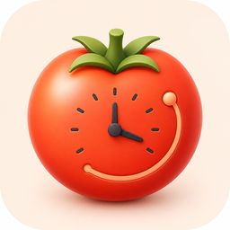

<p align="center">
  
</p>

<h1 align="center">TomaTrace</h1>

TomaTrace is a native macOS 14+ menu-bar Pomodoro timer with Todoist task
integration and local focus analytics.

## Features

- Configurable work, short-break, and long-break intervals
- Pause, resume, skip, notifications, sounds, shortcuts, and launch at login
- Todoist projects and active tasks with incremental sync and offline cache
- Task-linked focus sessions, notes, completion/undo, and durable offline writes
- Today, week, and month totals; daily trend; heatmap; task/project rankings
- Editable local history with actual focus duration and fractional pomodoros
- Optional floating timer and full-screen break reminder
- English, Simplified Chinese, and Korean localization

Todoist API tokens are stored only in macOS Keychain. Focus history is stored
locally with SwiftData and remains usable without Todoist or a network
connection.

## Development

Open `TomatoBar.xcodeproj`, choose the shared `TomatoBar` scheme and `My Mac`,
then press `Cmd-R`. Run the complete test suite with `Cmd-U`.

- [Product and engineering roadmap](docs/TOMATRACE_PLAN.md)
- [Xcode development, debugging, and distribution guide](docs/XCODE_GUIDE.md)
- [Contributor guidelines](AGENTS.md)

The URL command `open tomatrace://startStop` starts or stops the timer. Runtime
transition logs are written to:

```text
~/Library/Containers/com.linyangfeng.tomatrace/Data/Library/Caches/TomaTrace.log
```

## Origin and license

TomaTrace is based on
[Ilya Voronin's TomatoBar](https://github.com/ivoronin/TomatoBar). The original
copyright and MIT license are preserved in [LICENSE](LICENSE). Timer sounds
retain their existing buddhabeats license attribution.
